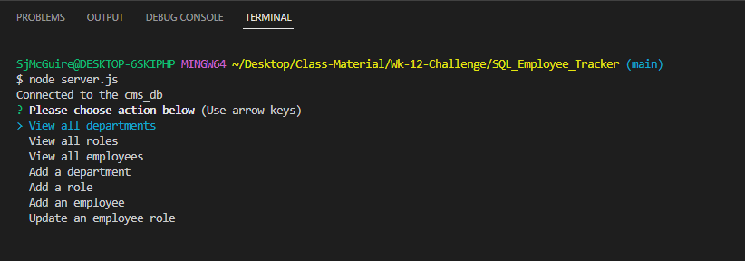
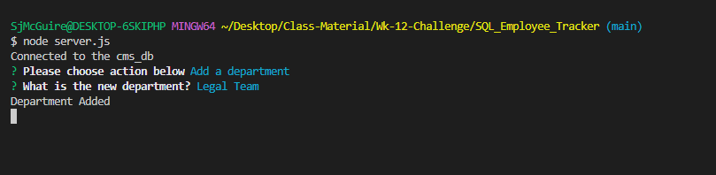
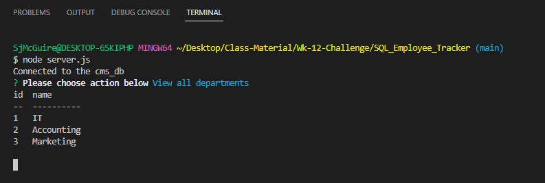
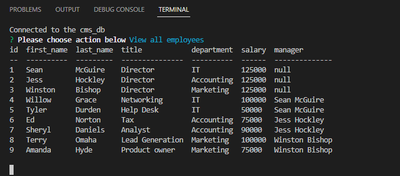

# SQL_Employee_Tracker

## Description

As a business owner I want to be able to view and manage my departments, roles, and employees in my company so that I can run my business efficiently.

When I launch the program I am given the option to View tables, Add to tables, and Update tables.  Which will make my day to day easier, since I have the ability to see all the departments, roles, and employees at the same time and make updates using the convenient command prompt.

This was a great project, I had SQL knowledge going in but learning how to tie this to other projects/ other things we've learned is going to be beneficial in future endeavors.

## Installation

The git hub code can be found here:  https://github.com/swmcguire/SQL_Employee_Tracker.git

The video link can be found here: 

In order to launch the program you'll have to navigate to the appropriate directory that houses the server.js file.

You'll have to run an npm install to envoke the different properties that are being used within the code.

Once this has been done, you'll be able to launch the software by using the 'node server.js' command.

This will launch the software and open a main menu screen of options which will allow you to toggle up and down through using the arrow keys.  

## Usage

Once the application has been launched you'll be brought to a main menu screen which you'll be able to toggle up and down through using the arrow keys. 

By toggling up and down using the arrow keys you'll be able to View the departments, view the roles, view the employees.  You'll also be able to Add to the department table, Add to the role table, Add to the Employee Table and Update the Employee Table.  When you select one of the updates/add options you'll be prompted to answer questions that will update/ add to the different databases.

When the questions have been answered the app will update the database and alert you that it has been updated.

## Credits

https://www.npmjs.com/package/inquirer 

https://www.npmjs.com/package/console.table?activeTab=readme 

https://www.w3schools.com/js/js_switch.asp 

## License

MIT License

Copyright (c) 2023 swmcguire

Permission is hereby granted, free of charge, to any person obtaining a copy
of this software and associated documentation files (the "Software"), to deal
in the Software without restriction, including without limitation the rights
to use, copy, modify, merge, publish, distribute, sublicense, and/or sell
copies of the Software, and to permit persons to whom the Software is
furnished to do so, subject to the following conditions:

The above copyright notice and this permission notice shall be included in all
copies or substantial portions of the Software.

THE SOFTWARE IS PROVIDED "AS IS", WITHOUT WARRANTY OF ANY KIND, EXPRESS OR
IMPLIED, INCLUDING BUT NOT LIMITED TO THE WARRANTIES OF MERCHANTABILITY,
FITNESS FOR A PARTICULAR PURPOSE AND NONINFRINGEMENT. IN NO EVENT SHALL THE
AUTHORS OR COPYRIGHT HOLDERS BE LIABLE FOR ANY CLAIM, DAMAGES OR OTHER
LIABILITY, WHETHER IN AN ACTION OF CONTRACT, TORT OR OTHERWISE, ARISING FROM,
OUT OF OR IN CONNECTION WITH THE SOFTWARE OR THE USE OR OTHER DEALINGS IN THE
SOFTWARE.
---
